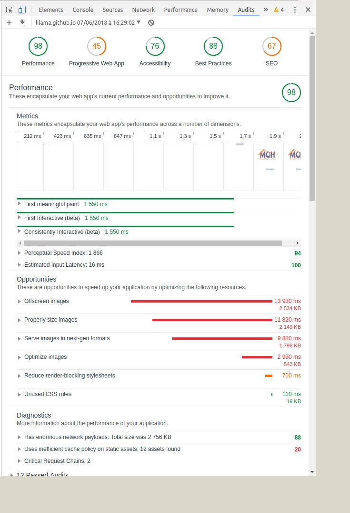

# becode-AHOD
Challenge Maison de Quartier Helmet
# Maison de quartier d'Helmet asbl

## Par qui?
* Team
** Arnaud Duchemin
** Liliane Mamale
** Gribaumont Thibault

## Quand?
* Le 07/06/2018

## Durée:
* 6 heures

## Où?
* Groupe Lovelace 2 chez [BeCode](https://github.com/becodeorg/)

## Quoi?
* Réalisation et déploiement d’un one-pager [MaisonDeQuartierHelmet]( https://lilama.github.io/becode-AHOD/) 

## Pourquoi?
* Réaliser en urgence un site web d'une page (= un "one-pager") qui propose une meilleure version du site existant [MaisonDeQuartierHelmet]( http://maisondequartierhelmet.be/).

## Comment?
* Analyser le contenu du site existant [MaisonDeQuartierHelmet](http://maisondequartierhelmet.be/) et bien comprendre l’objectif et la problématique du site existant.
* Piocher le contenu dans leur présence digitale actuelle. Rassembler du contenu pertinent sur base de ce que j’ai pu trouver.
* Une fois publié, utiliser le **Lighthouse Test** et améliorer mon code pour améliorer mes scores dans tous les domaines.

* Utilisation PWA
* Trouver si possible, un nom de domaine gratuit.

## Difficultés rencontrées:
* L’objectif du site existant n’est pas clair et est trop confus.
